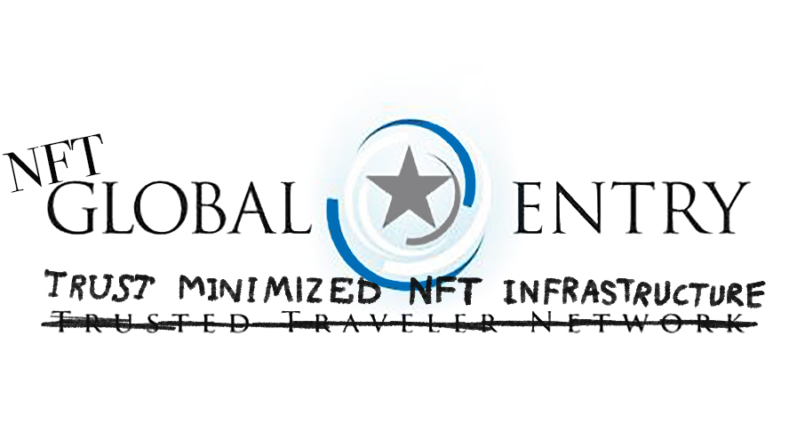
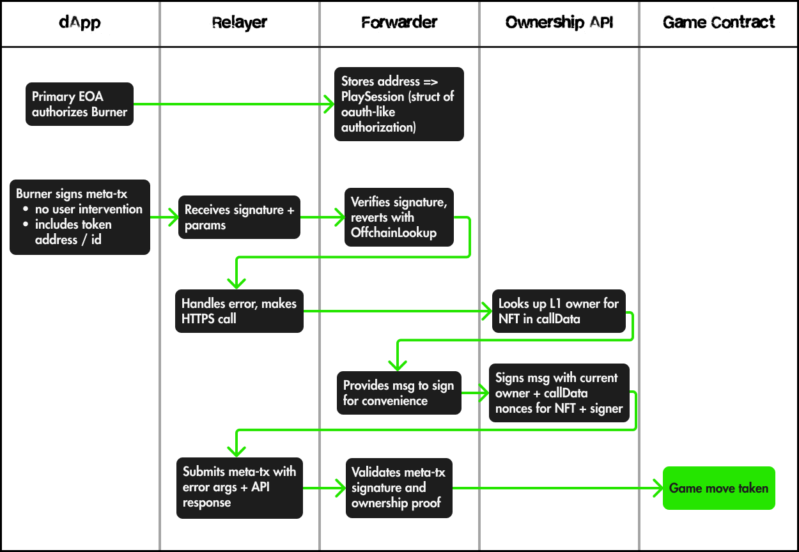

# NFT Global Entry


## Bringing crosschain NFT token gating to Canto

NFT Global Entry allows developers to build contracts that authorize NFT ownership from other chains.

Offchain services often use the term **token-gating** to describe this NFT ownership authorization.

Onchain token gating is restricted to NFTs on the same blockchain as the game, raffle or voting contract. Bridging tokens between chains is the primary solution for the challenge that blockchains cannot read the state of another blockchain.

NFT Global Entry leverages Ethereum standards to bring crosschain token gating to Canto contracts. Without forcing users to bridge assets, Canto developers can use NFT ownership data from any EVM chain to gate transactions in Canto contracts.

## How it works



At a very high level, NFTGlobalEntry requires transactions to include a signed _ownership proof_ from our trusted Ownership RPC Oracle.

This proof acts as a trusted stamp that the user currently owns the NFT they want to use. A first request provides a ticket and tells you where to get it stamped, then to come back with your proof of ownership.

### Offchain Lookup

For NFTGlobalEntry to be permissionless, transaction submitters need to know that a proof is required and how to acquire it. NFTGlobalEntry uses standardized [EIP-3668 OffchainLookup](https://eips.ethereum.org/EIPS/eip-3668) errors to communicate proof instructions to transaction submitters.

The transaction submitter calls `preflight` on the NFTGlobalEntry forwarder contract, specifying an NFT they want to "use" in a transaction - this view function will tell the submitter where and how to get the ownership proof, and how to submit a transaction with it.

The Ownership RPC Oracle is an API we offer that provides the required proof - this offchain infrastructure will look up the current owner of an NFT from any EVM chain, and return signed data that includes the current owner.

Given the proof, the transaction submitter now has everything they need to submit an NFTGlobalEntry transaction. If the transaction submitter is the current owner of the requested NFT, the GlobalEntryForwarder will call the implementation contract so that the transaction submitter can take a game move, enter a raffle or vote on a governance proposal "using" an NFT they own on another chain.

### Meta-transactions

NFTGlobalEntry uses [EIP-2771 meta-transactions](https://eips.ethereum.org/EIPS/eip-2771) - the transaction submitter is an account that sponsors the gas fee for the end user. The primary motivation is to allow users to use a dapp without switching wallet network or acquiring an esoteric gas token.

EIP-3668 is also not widely supported for contract writes - meta-transactions allow us to write custom code to handle the preflight, proof gathering and transaction submission.

Early user feedback suggests the meta-tx signatures are scary. To address these concerns GlobalEntry supports account abstraction at multiple layers and we're exploring ways to submit ownership-proofed transactions directly from a user's wallet.

## Infrastructure

We've been developing the infrastructure for NFT Global Entry for a number of months. All of our software is based on final stage EIPs.

We've used the Canto Online Hackathon to add Canto support to the existing infrastructure.

### CantoRelayer

In EIP-2771 meta-transactions, the **Relayer** receives signed requests offchain from a **Transaction Signer** and submits a transaction on behalf of the signer, paying the transaction fees. We normally use OpenZeppelin Defender for relaying 

OZ doesn't support Canto so we re-purposed our code in a NextJS API route:

[View Canto Relayer](https://github.com/sbauch/definitely-members/blob/add-governance/packages/app/src/pages/api/relayer.ts)

### GlobalEntryForwarder

Our forwarder is an EIP-2771 meta-transaction protocol. We plan to deploy a canonical version at the same address across multiple chains, but during the hackathon deployed it to Canto [mainnet](https://evm.explorer.canto.io/address/0x3E4404d874fa73659cCfFc21Ac4839EcA21F0b4c). 

[View Forwarder Deployment](https://evm.explorer.canto.io/address/0x3E4404d874fa73659cCfFc21Ac4839EcA21F0b4c)

### Ownership RPC Oracle

The Ownership RPC Oracle is an API responsible for providing a proof of the current owner of a requested NFT.

The Ownership RPC Oracle integrates [delegate.cash](https://delegate.cash). If the address attempting to use the requested NFT has been delegated access by the NFT owner, a valid ownership proof will be returned.

## Tooling

To consume NFTGlobalEntry infrastructure, we provide developer SDKs for EVM contracts and ethers-based dapps.

The Canto Online Hackathon helped further develop and refine these offerrings.

### Solidity SDK

The Solidity SDK provides an inheritable `Context` contract for NFTGlobalEntry.

Developers inherit `EssentialERC2771Context` and call its constructor with a `trustedForwarder` address (the GlobalEntryForwarder).

They can then use the `_msgNFT()` function, which returns a struct with the chain ID, contract address and token ID of an NFT that is owned by `_msgSender()`.

For example, you could add a modifier that restricts decorated functions to owners of an NFT from a particular collection on ETH mainnet:

```solidity
    uint256 constant NFT_CHAIN_ID = 1;
    address constant NFT_CONTRACT = address(420);

    modifier onlyCommunityMember() {
        require(isTrustedForwarder(msg.sender), "Invalid");
        IForwardRequest.NFT memory token = _msgNFT();
        require(
            token.chainId == CHAIN_ID && token.contractAddress == NFT_CONTRACT,
            "Unauthorized"
        );
        _;
    }
```

### Dapp SDK

The Dapp SDK provides an ethers-based `Signer` class that handles all of the meta-transaction nuts and bolts with familiar developer ergonomics.

The SDK works nicely with wagmi and anywhere else you use ethers, like hardhat tests.

The hackathon yielded hooks that replicate wagmi's `usePrepareContractWrite` and `useContractWrite` will be integrated to the SDK or a peer package.

With these hooks developers can replace the function name to convert a standard contract write to an NFTGlobalEntry contract write:

```typescript
  const { config } = useGlobalEntryPrepareContractWrite({ // vs. wagmi usePrepareContractWrite
    ...GOVERNANCE_CONTRACT, // address + abi
    functionName: "castVote",
    args: [BigNumber.from(proposalId), 1],
    overrides: {
      customData: {
        // here you specify the NFT to "use" in the transaction
        nftContract: MEMBERSHIPS_CONTRACT.address,
        nftTokenId: membership?.tokenId,
        nftChainId: 1,
      },
    },
  });

  // calling write() will pop the user's wallet to sign a meta-transaction
  // that the SDK submits to your relayerUrl
  const { write } = useGlobalEntryContractWrite(config as any); // vs. wagmi useContractWrite

  const castVoteTx = useWaitForTransaction({ // still wagmi
    hash: castVote.data?.hash,
  })
```

## NFTGovernance

During the hackathon I built a proof of concept contract and dapp features for onchain governance on Canto for an NFT community from mainnet.

I'm a member of [DEF](https://def.xyz), a DAO that happened to launch membership NFTs during the hackathon, perfect timing. I forked the dapp repo and added a few pages for governance.

I didn't realize how "onchain" onchain governance is - I went into the project just expecting to build a simple contract that allowed holders to submit a proposal and for other holders to vote on it. But I used OpenZeppelin's Governor contracts as a starting point, which is overkill and very much not applicable to the crosschain usecase.

The contracts here do a lot more than we can actually use them for - creating a proposal allows specifying function selectors that will be called when the proposal executes. Since the NFT contract exists on mainnet, and there's no relevant contracts to govern on Canto, this is all useless but still a good example of the type of thing we can build with NFTGlobalEntry. And we can of course use it for onchain _recorded_ governance, where we vote on things that then require someone to be trusted to execute.

### Contracts

Using OpenZeppelin Governor contracts as a base, I developed a Governor-compatible contract that uses NFTGlobalEntry to allow holders of the DEF Membership NFTs to create proposals and vote on them. If you do not hold one of these tokens you will not be able to create proposals or vote.

Each vote must be unique by both address and token ID - GlobalEntry only provides binary authorization of owning a specific NFT (chainId, contract address, tokenId), but this project suggested that we may want to add other authorizations like token balance to support weighted voting. Restricting votes by tokenId prevents someone from transferring the membership token to a new address to vote multiple times.

I also store more data in contract state compared to the OZ base contracts - without a Canto indexing service its the simplest way to surface certain data to the dapp.

[Contract Source](https://github.com/0xEssential/canto-global-entry/tree/main/contracts/src/NFTGovernor)

[Contract Deployment](https://evm.explorer.canto.io/address/0xc231c1F12fd42D0aB66eDb28e6b040A923b75f1b)

#### Testing

NFTGlobalEntry involves a lot of signing things with different keys, so testing contracts that integrate it can be challenging.

We invested a lot of effort into testing and share tools and examples with other developers. The submission includes both Foundry and Hardhat tests.

The Foundry tests are more like unit tests, but also test the interaction between NFTGlobalEntryForwarder and NFTGovernor. A production project might isolate the Governor logic for pure unit tests, but an example for how to sign things in Foundry and how to mock our offchain infrastructure is instructive.

The hardhat tests are more integrative - they import low level functions from our dapp SDK for signing the meta-tx payload. This helps us be confident in the dapp SDK while also providing some examples for a frontend developer integrating the dapp SDK.

[View Tests](https://github.com/0xEssential/canto-global-entry/tree/main/contracts/test)

### Dapp

The DEF client app already had much of the tooling needed to interact with EVM chains. Integrating NFTGovernance required adding Canto as a custom chain for wagmi and adding addresses and ABIs from our deployments.

I installed the NFTGlobalEntry dapp SDK and added a few pages for governance. DEF token holders can submit new proposals with a string description. Anyone can view proposals, while voting is restricted to holders.

[View Dapp Changes](https://github.com/sbauch/definitely-members/pull/3)
